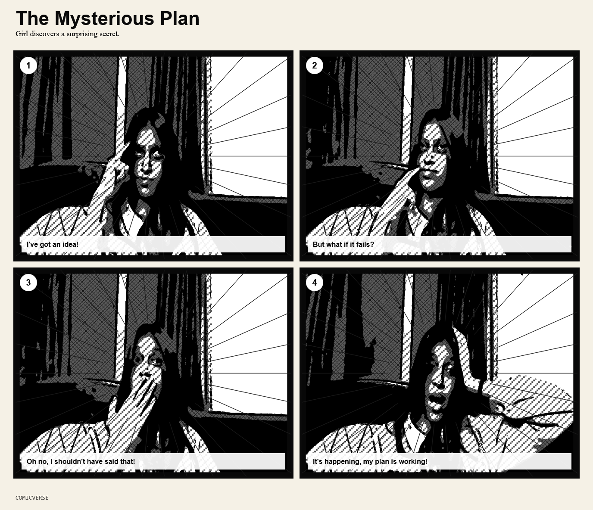
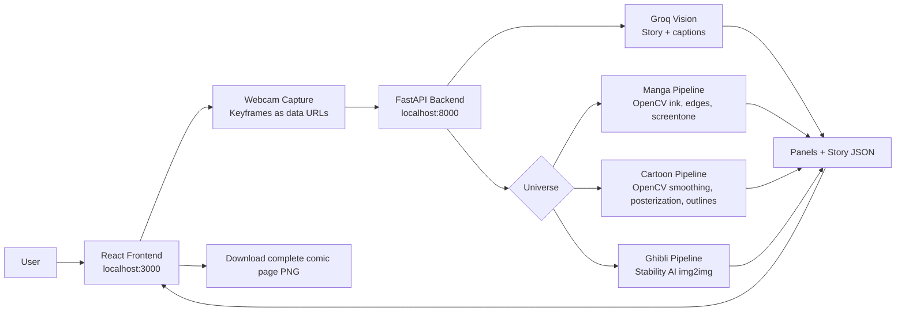

# ComicVerse

ComicVerse is a webcam-to-comic application that turns captured keyframes into styled comic panels with story context. Users choose a universe, capture frames, generate stylized panels, receive AI-written captions, and download the complete comic page as a PNG.

## Features

- Three visual universes: Manga, Cartoon, and Ghibli-inspired.
- Browser webcam capture with keyframe selection.
- Python backend for image processing and AI service routing.
- OpenCV-based Manga and Cartoon stylization.
- Stability AI image-to-image generation for Ghibli mode.
- Groq Vision story generation from captured keyframes.
- Per-panel story captions and a complete comic-page PNG export.
- Local frontend/backend development setup.

## Example Outputs

### Manga Mode

Generated Manga comic page with inked panels, halftone texture, speed-line treatment, and Groq-generated captions.



### Cartoon Mode

Generated Cartoon comic page with posterized colors, bold outlines, and story captions.


## Tech Stack

| Layer | Technology |
| --- | --- |
| Frontend | React, TanStack Router/Start, Vite, Tailwind CSS, Framer Motion |
| Backend | Python, FastAPI, Uvicorn |
| Image Processing | OpenCV, NumPy, Pillow |
| Ghibli Generation | Stability AI Stable Diffusion image-to-image API |
| Story Generation | Groq Vision chat completions |
| Optional Local Ghibli | Hugging Face Diffusers |

## Architecture



## Generation Pipeline

1. The user opens the frontend at `http://127.0.0.1:3000`.
2. The user chooses Manga, Cartoon, or Ghibli.
3. The browser starts the webcam and captures selected keyframes.
4. The frontend sends keyframes to `POST /api/generate`.
5. The backend decodes frames and sends up to five keyframes to Groq Vision.
6. Groq returns structured story data: title, premise, panel captions, and ending.
7. The backend routes image generation by universe:
   - Manga uses OpenCV grayscale, adaptive thresholding, edge ink, screentone, and ink intensity.
   - Cartoon uses OpenCV smoothing, saturation, posterization, and bold outlines.
   - Ghibli uses Stability AI image-to-image by default.
8. The frontend renders the generated panels with captions.
9. The user downloads the final combined comic page as one PNG.

## Project Structure

```text
ComicVerse/
  backend/
    main.py              FastAPI app and /api/generate route
    filters.py           OpenCV Manga, Cartoon, and fallback Ghibli filters
    stability_ai.py      Stability AI Ghibli image-to-image client
    ghibli_diffusion.py  Optional local Diffusers Ghibli backend
    story.py             Groq Vision story and caption generation
  src/
    routes/
      index.tsx          Universe picker page
      universe.$type.tsx Webcam, generation, preview, download flow
    lib/
      backend.ts         Frontend API client
      universes.ts       Universe metadata and styling config
      sfx.ts             Sound effect manager
  .env.example           Environment variable template
  requirements.txt       Python dependencies
  package.json           Frontend/backend scripts
```

## Setup

Install Python dependencies:

```powershell
cd <Project_Directory>
python -m pip install -r requirements.txt
```

Install frontend dependencies:

```powershell
npm install
```

Create or update `.env` from `.env.example`, then add your API keys.

## Environment Variables

### Stability AI

Used for Ghibli image-to-image generation.

```env
GHIBLI_BACKEND=stability
STABILITY_API_KEY=
STABILITY_MODEL=sd3.5-large
STABILITY_PROMPT=ghibli inspired anime portrait, soft watercolor lighting, hand painted background, warm natural colors, expressive face, clean linework, cinematic composition
STABILITY_NEGATIVE_PROMPT=photorealistic, blurry, distorted face, bad anatomy, extra fingers, text, watermark
STABILITY_STRENGTH=0.6
STABILITY_OUTPUT_FORMAT=png
STABILITY_TIMEOUT_SECONDS=120
```

`GHIBLI_BACKEND` options:

- `stability`: use Stability AI hosted image-to-image.
- `diffusion`: use local Hugging Face Diffusers.
- `opencv`: use the fast local OpenCV painted filter.

### Groq

Used for story generation from image keyframes.

```env
GROQ_API_KEY=
GROQ_MODEL=meta-llama/llama-4-scout-17b-16e-instruct
GROQ_TEMPERATURE=0.8
GROQ_MAX_COMPLETION_TOKENS=600
GROQ_TIMEOUT_SECONDS=45
```

The default Groq model is selected because it supports vision input and structured JSON-style responses.

### Optional Local Diffusers

Only needed when `GHIBLI_BACKEND=diffusion`.

```env
GHIBLI_MODEL_ID=nitrosocke/Ghibli-Diffusion
GHIBLI_PROMPT=ghibli style, soft anime portrait, hand painted watercolor background, warm natural light, clean expressive face, detailed eyes
GHIBLI_NEGATIVE_PROMPT=low quality, blurry, distorted face, extra fingers, bad anatomy, text, watermark
GHIBLI_STRENGTH=0.6
GHIBLI_GUIDANCE_SCALE=7.5
GHIBLI_INFERENCE_STEPS=30
HUGGINGFACE_TOKEN=
```

## Running Locally

Start the backend in Terminal 1:

```powershell
cd <Project_Directory>
npm run backend
```

Backend health check:

```text
http://127.0.0.1:8000/api/health
```

Start the frontend in Terminal 2:

```powershell
cd <Project_Directory>
npm run dev
```

Open the app:

```text
http://127.0.0.1:3000
```

Do not use `http://127.0.0.1:8000` as the app page. Port `8000` is only the backend API.

## API

### `GET /api/health`

Returns backend status.

```json
{ "status": "ok" }
```

### `POST /api/generate`

Generates panels and story data.

Request:

```json
{
  "universe": "manga",
  "frames": ["data:image/jpeg;base64,..."],
  "strength": 0.6,
  "ink_intensity": 0.78
}
```

Response:

```json
{
  "universe": "manga",
  "panels": ["data:image/png;base64,..."],
  "story": {
    "title": "Manga Awakening",
    "premise": "A normal webcam moment becomes the opening scene of a comic adventure.",
    "captions": ["A quiet moment becomes the first panel of a bigger destiny."],
    "ending": "The next chapter is waiting just outside the frame."
  }
}
```

## Scripts

| Command | Purpose |
| --- | --- |
| `npm run dev` | Start the frontend dev server |
| `npm run backend` | Start the FastAPI backend |
| `npm run build` | Build the frontend and server bundle |
| `npm run preview` | Preview the production build |
| `npm run lint` | Run ESLint |
| `npm run format` | Format source files |

## References

The implementation is inspired by the following repositories:

1. Manga reference: [yuikoito/manga-backend](https://github.com/yuikoito/manga-backend)
2. Cartoon reference: [SystemErrorWang/White-box-Cartoonization](https://github.com/SystemErrorWang/White-box-Cartoonization)
3. Ghibli reference: [TheAppWizard/GhibliArt](https://github.com/TheAppWizard/GhibliArt)

ComicVerse does not copy these projects directly. It uses them as style and pipeline references while implementing a practical local Python/OpenCV backend plus hosted AI integrations for image and story generation.
